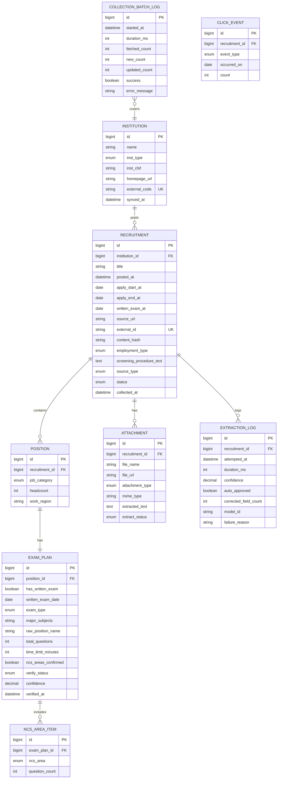
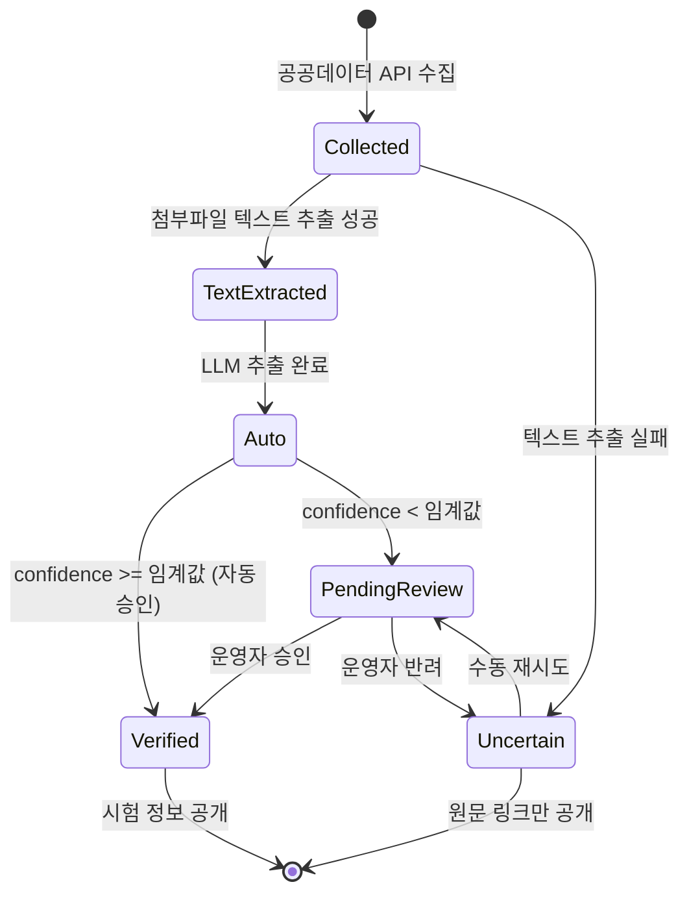

# 도메인 모델

## 1. 핵심 설계 원칙

> **시험 구성은 공고(Recruitment)가 아니라 직렬(Position)에 붙는다.**

같은 공고 안에서도 행정직은 NCS만, 전산직은 전공+NCS를 보는 경우가 흔하다. 시험 정보를 공고 단위로 저장하면 이 서비스의 존재 이유인 필터링이 불가능해진다. 이 구조는 어떤 이유로도 단순화하지 않는다.

## 2. ERD



## 3. Enum 정의

### JobCategory (직렬)
재정경제부 API의 NCS 대분류 코드(`ncsCdLst`)와 매핑한다. MVP는 `IT`, `ADMIN` 두 개만 수집한다.

| 우리 코드 | API 코드 | NCS 대분류명 | MVP |
|---|---|---|---|
| `IT` | `R600020` | 정보통신 | ✅ |
| `ADMIN` | `R600002` | 경영.회계.사무 | ✅ |
| `MECHANICAL` | `R600015` | 기계 | v2 |
| `ELECTRICAL` | `R600019` | 전기.전자 | v2 |
| `CIVIL` | `R600014` | 건설 | v2 |
| `CHEMICAL` | `R600017` | 화학 | v2 |
| `ENV_ENERGY` | `R600023` | 환경.에너지.안전 | v2 |
| `RESEARCH` | `R600025` | 연구 | v2 |

> **NCS 대분류라 정밀도에 한계가 있다.** `R600002 경영.회계.사무`에는 행정직 외 회계·인사·총무가 포함되고, 전산직이 `R600020`이 아닌 코드로 등록되는 공고도 있을 수 있다. W0에서 교차 확인하고, 필요하면 제목 키워드 보정을 검토한다.

### InstitutionType (기관유형)
**⚠️ `/list`의 `instType`은 콤마 다중값을 지원하지 않는다.** 단일값은 정상 동작하므로 **A2001~A2004를 각각 4회 호출해 병합한다.**

**MVP는 A2001~A2004만 수집한다.** A2005(기타공공기관)는 수백 개 기관이 포함되어 필기시험이 없는 소규모 기관이 대거 섞이므로 제외한다.

```
A2001  공기업(시장형)         ✅
A2002  공기업(준시장형)       ✅
A2003  준정부기관(기금관리형) ✅
A2004  준정부기관(위탁집행형) ✅
A2005  기타공공기관           ❌ MVP 제외
```

### AttachmentType (첨부유형)
API `files[].atchFileType`.

| 코드 | 명칭 | 파싱 | 얻는 것 |
|---|---|---|---|
| `A` | 공고문 | ✅ | 필기시험일, 시험 유형, 문항 수, 직렬별 인원 |
| **`Z`** | 기타 | ✅ **조건부** | **참고자료에 NCS 세부 영역이 있음** |
| `B` | 입사지원서 | ❌ | |
| `C` | 직무기술서 | ❌ | |

> **`Z`(기타)를 반드시 포함한다.** 한국철도공사 공고 확인 결과, 공고문 본문은 "필기시험 세부사항은 [참고7]에서 확인"이라고만 하고, 실제 NCS 영역은 `Z` 타입의 `채용 공고 참고자료.pdf`에 있다. `A`만 받으면 이 서비스의 차별점을 확보할 수 없다.
>
> 단 `Z`에는 `자기소개서.pdf` 같은 무관한 파일도 섞인다. **파일명에 `참고`, `세부`, `별첨` 등이 포함된 것만 선별**하는 휴리스틱을 적용하고, 선별 실패 시 `Z` 전체를 받되 크기 상한을 지킨다.

> **`ATTACHMENT.attachment_type`에 A/B/C/Z 4개 값을 모두 정의한다.** 단, 실제로 행이 저장되는 것은 `A`(공고문)와 `Z`(기타)뿐이다. `B`(입사지원서)·`C`(직무기술서)는 수집 단계에서 필터링되어 애초에 저장되지 않는다. 4값을 모두 정의해두는 이유는 API 원본 코드 체계를 그대로 보존해 향후 필터링 정책이 바뀌어도 Enum을 다시 설계할 필요가 없게 하기 위함이다. "2차: 첨부 공고문(`atchFileType="A"`)" 추출 단계는 이 컬럼으로 `A`만 골라서 처리한다.

### ExamType (시험 유형)
```
NCS_ONLY         NCS 직업기초능력만
NCS_PLUS_MAJOR   NCS + 전공
MAJOR_ONLY       전공만
OTHER            인적성 등 기타
UNKNOWN          추출 실패
```

### NcsArea (NCS 직업기초능력 10영역)
기관마다 표기가 다르므로(`정보능력` / `정보처리능력` / `정보`) LLM 프롬프트에서 반드시 이 Enum으로 정규화한다.

```
COMMUNICATION      의사소통능력
MATH               수리능력
PROBLEM_SOLVING    문제해결능력
SELF_DEVELOPMENT   자기개발능력
RESOURCE_MGMT      자원관리능력
INTERPERSONAL      대인관계능력
INFORMATION        정보능력
TECHNOLOGY         기술능력
ORGANIZATION       조직이해능력
ETHICS             직업윤리
```

### SourceType (수집 소스)
운영 중 주 소스를 교체하거나 보조 소스를 추가할 수 있으므로, 모든 공고에 출처를 기록한다. 소스별 커버리지·정확도 비교의 근거가 된다.

```
MPM         인사혁신처_공공취업정보
MOEF        재정경제부_공공기관 채용정보 (알리오)
MOIS        행정안전부_지방공공기관 채용정보 (v1.1 이후)
MANUAL      운영자 수동 등록
```

### EmploymentType (고용유형)
API `hireTypeLst`. **MVP 수집 대상은 `R1010`, `R1030`, `R1070`.**

| API 코드 | 명칭 | 우리 Enum | 수집 |
|---|---|---|---|
| `R1010` | 정규직 | `FULL_TIME` | ✅ |
| `R1070` | 청년인턴(채용형) | `INTERN_HIRE` | ✅ 판단 보류 |
| `R1020` | 계약직 | `CONTRACT` | ❌ |
| `R1030` | 무기계약직 | `PERMANENT_CONTRACT` | ✅ (W1 실측: 순수 R1030 6건 중 2건 필기 시행) |
| `R1040` | 비정규직 | `NON_REGULAR` | ❌ |
| `R1050` | 청년인턴 | `INTERN` | ❌ |
| `R1060` | 청년인턴(체험형) | `INTERN_EXP` | ❌ |

> **v2 확장은 스키마 변경 없이 가능하다.** 7개 코드가 모두 Enum에 정의되어 있고 `employment_type` 컬럼도 존재하므로, 수집 파라미터에 코드를 추가하는 것만으로 확장된다.
>
> **`R1030`(무기계약직)은 포함한다.** `instType` A2001~A2004 전체에서 R1030 9건을 전수 조사한 결과, `R1010`과 섞이지 않은 순수 R1030 단독 공고 6건 중 2건(33%)이 필기시험을 시행했다(국민연금공단, 한국산림복지진흥원). 나머지 3건은 애초에 `R1010`과 혼합 표기돼 있어 기존 필터로도 이미 수집되고 있었다. 무시할 수 없는 필기 시행 비율이고 물량도 적어(A2001~A2004 합쳐 9건) 포함 비용이 낮다. 근거: `docs/adr/0004-extraction-input-analysis.md` 발견 5.
>
> **`R1070`(채용형 인턴)은 포함한다.** 정규직 전환 전제라 필기를 보는 기관이 많다(한전, 코레일 등). 다만 기관마다 다르므로, 운영 중 `UNCERTAIN` 비율을 보고 제외 여부를 재판단한다.

### VerifyStatus (검수 상태)
```
AUTO        LLM 추출만 완료. 화면에 시험 정보 노출 금지
VERIFIED    운영자 승인 완료. 노출 가능
UNCERTAIN   추출 실패 또는 반려. 원문 링크만 제공
```

### RecruitmentStatus
```
UPCOMING    접수 예정
OPEN        접수 중
CLOSED      접수 마감
CANCELED    공고 취소
```

## 4. 상태 전이

### 공고 수집 → 노출까지



**핵심 규칙**: `Verified` 상태에 도달하지 못한 `EXAM_PLAN`의 시험 정보는 어떤 API 응답에도 포함되지 않는다. 응답 DTO 생성 단계에서 필터링하고, 이를 검증하는 테스트를 반드시 작성한다.

## 5. 인덱스 전략

| 테이블 | 인덱스 | 용도 |
|---|---|---|
| `RECRUITMENT` | `(apply_end_at, status)` | 마감 임박순 목록 (기본 정렬) |
| `RECRUITMENT` | `content_hash` UNIQUE | 중복 수집 차단 |
| `RECRUITMENT` | `(apply_start_at, apply_end_at)` | 캘린더 월 범위 조회 |
| `POSITION` | `(job_category, recruitment_id)` | 직렬 필터 |
| `EXAM_PLAN` | `(exam_type, verify_status)` | 시험 유형 필터 |
| `NCS_AREA_ITEM` | `(ncs_area, exam_plan_id)` | NCS 영역 필터 (핵심 기능) |
| `EXTRACTION_LOG` | `attempted_at` | 주간 지표 집계 |
| `RECRUITMENT` | `(source_type, collected_at)` | 소스별 커버리지 비교 |

## 6. 캐시 전략 (Redis)

| 키 | 값 | TTL | 무효화 |
|---|---|---|---|
| `calendar:{year}:{month}:{category}` | 월 캘린더 이벤트 목록 | 1시간 | 수집 배치 완료 시 |
| `recruitments:{filterHash}:{page}` | 목록 조회 결과 | 10분 | 수집 배치 완료 시 |
| `meta:health` | 마지막 수집 성공 시각 | 없음 | 배치마다 갱신 |
| `ics:{filterHash}` | 생성된 ics 문자열 | 30분 | 수집 배치 완료 시 |

채용 시즌 트래픽 스파이크는 대부분 목록·캘린더 조회에 몰린다. 이 두 개만 캐싱해도 충분하다.

## 7. 설계상 주의점

**`content_hash` 계산 범위** — 공고 제목 + 접수기간 + 첨부파일 메타(파일명, 크기)를 합쳐 해싱한다. 첨부파일 본문까지 포함하면 매번 다운로드해야 해서 의미가 없다.

**정정공고 처리** — 기존 공고와 `source_url`이 같고 `content_hash`가 다르면 갱신으로 판단한다. 이때 이미 `VERIFIED`된 `EXAM_PLAN`은 자동으로 `AUTO`로 되돌리고 재검수 큐에 넣는다. 일정만 바뀐 경우가 대부분이지만 시험 과목이 바뀌는 경우도 있기 때문이다.

**`EXTRACTION_LOG.model_id`** — 어떤 LLM 모델로 추출했는지 기록한다. 모델을 바꿨을 때 자동 승인률과 필드 정확도가 어떻게 변했는지 비교하려면 이 값이 있어야 한다. 프롬프트 버전도 함께 남기면 더 좋다.

**다중 소스 대비** — 수집 어댑터는 `RecruitmentSource` 인터페이스로 추상화한다. 각 API의 응답 DTO가 도메인 엔티티에 직접 매핑되지 않게 하고, 어댑터 내부에서 도메인 모델로 변환한다. MVP는 소스 1개만 사용하지만, 인터페이스는 처음부터 둔다.

**여러 소스를 병합하지 않는 이유** — 같은 공고가 두 소스에 모두 존재할 수 있다. 중복 판정은 기관명 표기 차이(`한국전력공사` vs `한전`)와 제목 유사도 매칭이 필요해 비용이 크다. MVP는 단일 소스로 시작하고, 커버리지 부족이 실제로 확인된 뒤에 병합 전략을 별도 ADR로 결정한다.

### 미확인 정보 표현 규칙

**필드 단위로 null을 허용하고, null은 화면에서 "공고문 직접 확인 필요"로 렌더링한다.**

| 필드 | null의 의미 |
|---|---|
| `has_written_exam = false` | 필기전형 없음이 **확인됨** → "필기전형 없음" 표시 |
| `has_written_exam = null` | 필기 유무 자체를 모름 → "공고문 직접 확인 필요" |
| `exam_type = null` | 유형 미확인 |
| `ncs_areas_confirmed = false` | NCS 영역을 확보하지 못함 → 빈 배열이 아니라 "확인 필요"로 표시 |
| `written_exam_date = null` | 시험일 미확인. 캘린더에 표시하지 않음 |

`ncs_areas_confirmed`가 필요한 이유: **"NCS 영역이 없다"와 "NCS 영역을 모른다"는 다르다.** 전자는 전공만 보는 시험일 수 있고, 후자는 정보 부재다. 빈 배열 하나로 둘을 구분할 수 없으므로 플래그를 둔다.

`raw_position_name`은 공고문에서 추출한 기관 고유 직렬명(`사무영업`, `전기통신` 등)을 원문 그대로 보관한다. NCS 대분류와 병기해 사용자가 직접 판단할 수 있게 한다.

### `steps[]` 처리 규칙 (중요)

`/detail`의 `steps[]`는 **모집단위 × 전형단계**로 펼쳐져 있어 같은 모집단위가 3행씩 반복된다.

```
sortNo=0  →  "토목(공개경쟁채용)"        × 3행
sortNo=1  →  "전기통신(공개경쟁채용)"    × 3행
sortNo=2  →  "운전(자격증 제한경쟁채용)" × 3행
...
```

**`sortNo`로 그룹핑해 중복을 제거한다.** 위 예시는 33행이지만 실제 모집단위는 11개다.

| 필드 | 활용 |
|---|---|
| `recrutPbancTtl` | **`POSITION.raw_position_name`에 그대로 저장.** 직렬명 + 전형구분이 함께 들어있다 |
| `sortNo` | 모집단위 식별자 |
| `recrutNope` | **항상 `null`.** 직렬별 인원은 API로 얻을 수 없어 공고문 표에서 파싱해야 한다 |
| `cmpttRt` | 경쟁률. 마감 후에만 값이 들어옴 |

**NCS 대분류 오분류가 실증되었다.** 한국철도공사 공고의 `ncsCdLst`에 `R600020 정보통신`이 포함되나, 실제 모집단위 11개 중 전산직은 없다. `전기통신`은 전기·신호 설비 직무다. → 필터는 대분류로 하되 `raw_position_name`을 반드시 병기해 사용자가 판단하게 한다.

**`ongoingYn`은 `/detail`에서 `null`로 온다.** `/list`에서만 값이 채워지므로, 상태 판단은 `/list` 값 또는 `pbancEndYmd` 기준으로 한다.

**`RECRUITMENT.screening_procedure_text`** — API가 제공하는 전형절차 설명(`scrnprcdrMthdExpln`)을 그대로 저장한다. **시험 정보 추출의 1차 입력이다.** 이 텍스트만으로 추출이 되면 첨부파일 다운로드·파싱을 건너뛸 수 있다.

**추출 2단 전략 (실제 응답 검증 완료)**

| 단계 | 입력 | 얻는 것 |
|---|---|---|
| 1차 | `screening_procedure_text` | 필기 유무, `exam_type`, 문항 수 |
| 2차 | 첨부 공고문 (`atchFileType="A"`) | **NCS 세부 영역** |

**1차에서 필기전형이 없다고 판정되면 2차를 수행하지 않는다.** 표본상 공고의 약 90%가 서류+면접만 시행하므로, 이 분기가 첨부파일 다운로드·HWP 파싱·LLM 호출량을 1/10로 줄인다. `EXTRACTION_LOG`에 어느 단계까지 갔는지 기록해 1차 판정 정확도를 추적한다.

**`/list`와 `/detail`의 차이** — `/list` 응답의 `files`와 `steps`는 항상 빈 배열이다. `ATTACHMENT`와 직렬별 `POSITION` 정보를 채우려면 `/detail`을 호출해야 한다. 또한 `/list`의 `recrutNope`는 공고 전체 인원이며, 직렬별 인원은 `steps[]`에 있다.

**코드 정규화 시 관용성** — `ncsCdLst` 등은 콤마 구분 다중 값이며(`"R1010,R1070"`), 코드정의서 v1.2에 없는 코드가 실제로 존재한다(`R3027 = 전남광주`). **미정의 코드는 예외를 던지지 말고 `UNKNOWN`으로 저장하고 경고 로그만 남긴다.**

**`ATTACHMENT.extracted_text`** — 원본 파일은 저장하지 않고 추출된 텍스트만 보관한다. 스토리지 비용을 아끼고, 검수 화면에서 원문 대조에 쓴다. 파일 자체는 `file_url`로 링크만 유지한다.
