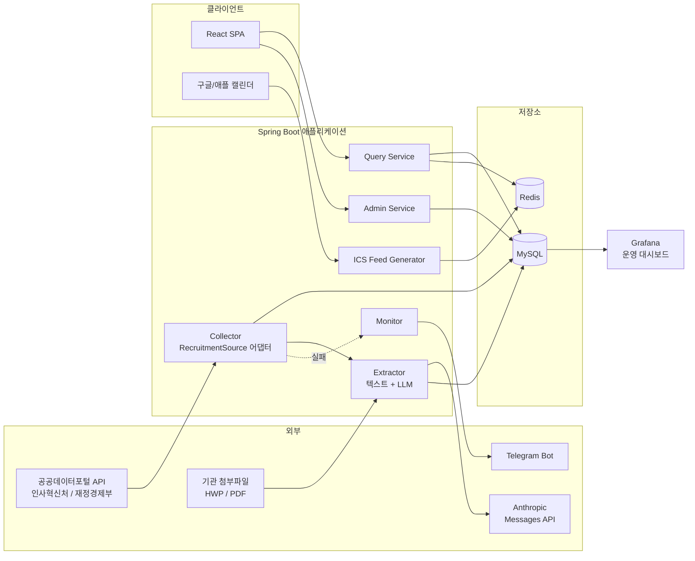
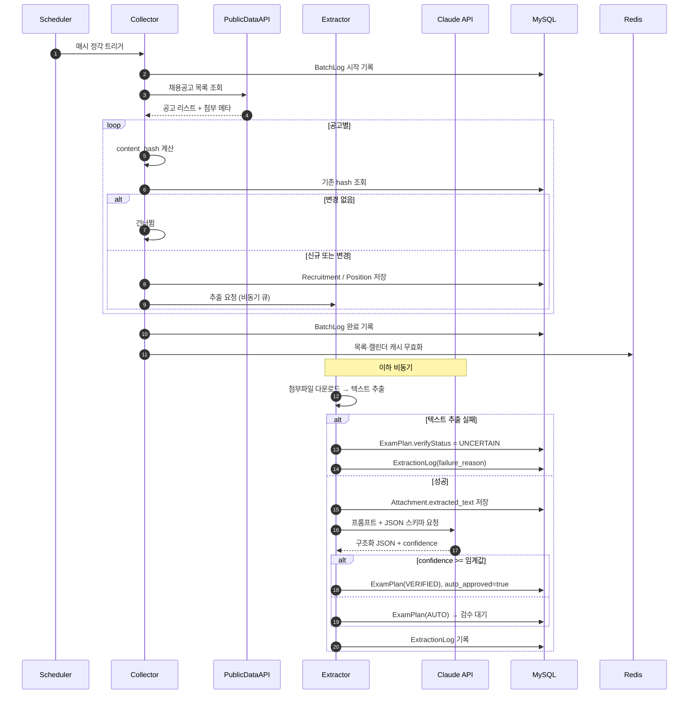
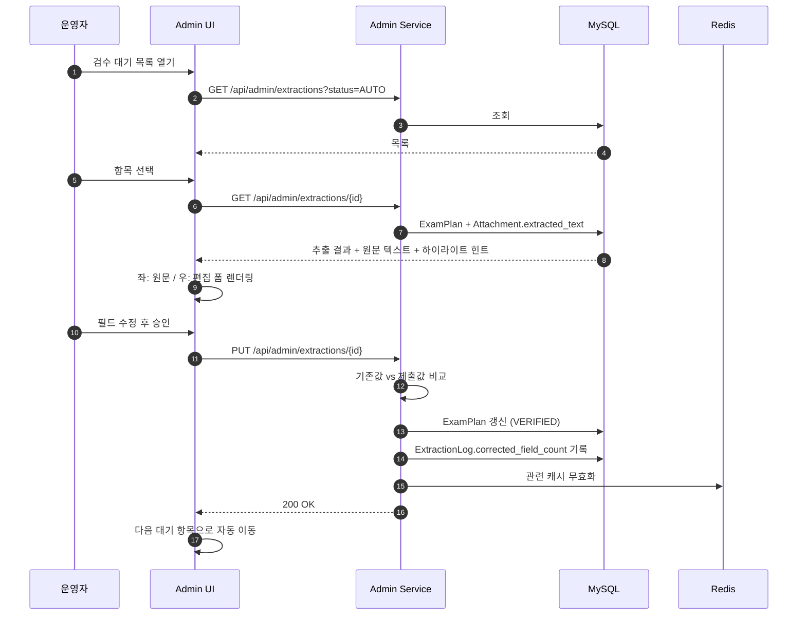
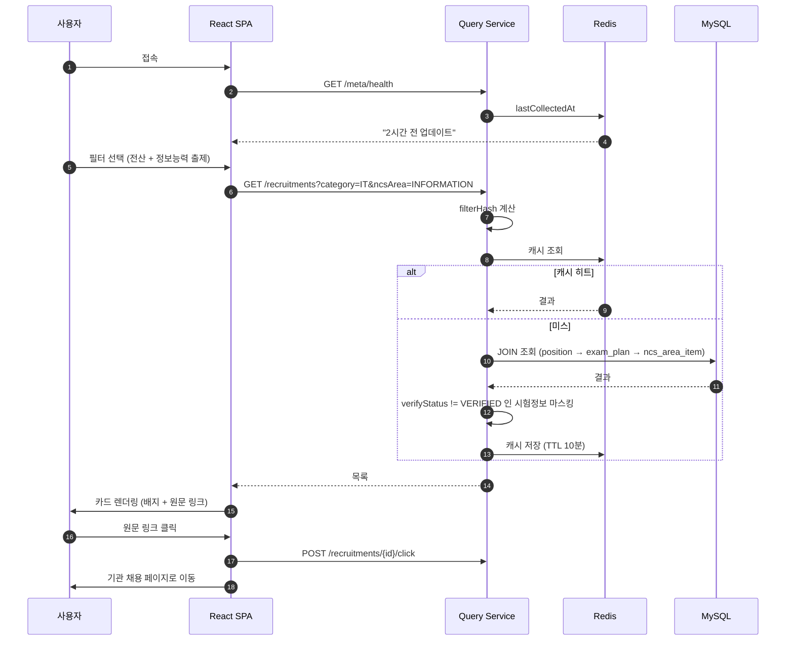
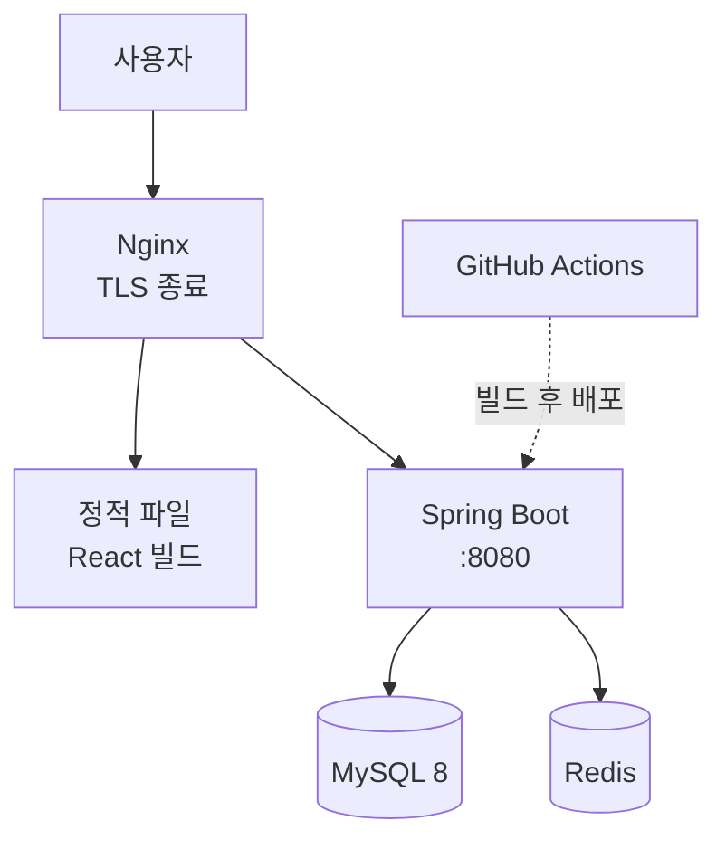

# 시스템 아키텍처

## 1. 전체 구성도



**모듈 분리 원칙** — Collector와 Extractor는 독립적으로 동작한다. 수집이 실패해도 이전에 수집된 공고의 추출은 계속 돌아가고, LLM API가 죽어도 수집과 조회는 정상 동작한다.

**수집 소스 추상화**

```
RecruitmentSource (interface)
├─ fetchList(from, to, page) : List<SourceRecruitment>
├─ fetchDetail(externalId)   : SourceRecruitmentDetail
├─ fetchAttachments(externalId) : List<SourceAttachment>
└─ getSourceType()          : SourceType

  ├── MpmRecruitmentSource    (인사혁신처)
  ├── MoefRecruitmentSource   (재정경제부 / 알리오)
  └── MoisRecruitmentSource   (행정안전부, v1.1)
```

각 구현체가 자기 API의 응답을 도메인 모델로 변환한다. 상위 Collector는 어느 소스인지 알 필요가 없다. W0에서 주 소스가 바뀌거나 운영 중 소스를 교체해도 수집 로직 전체를 다시 쓰지 않기 위한 구조다.

**Grafana는 읽기 전용 곁가지다** — 애플리케이션이 Grafana에 의존하지 않는다. MySQL에 읽기 전용 계정으로 붙어 지표를 조회할 뿐이므로, Grafana가 죽어도 서비스는 정상 동작한다. 반대로 서비스가 지표 집계용 API나 배치를 따로 만들 필요도 없다.

**트래픽 제한 대응** — 재정경제부 API는 일일 1,000건 제한이 있으나, **응답 헤더 `X-RateLimit-Remaining`으로 잔여량을 알려준다.** 별도 카운터를 관리하지 않고 이 헤더를 파싱해 임계값 아래면 `/detail` 호출을 다음 배치로 미룬다.

**2단 판정의 역할은 `/detail` 호출량 절감이 아니라 값비싼 추출 단계의 실행 여부 판단이다.** `/detail`은 필기 유무와 무관하게 모든 공고에 항상 호출한다 — `POSITION`이 `steps[]`에서 만들어지고 `EXAM_PLAN`이 `POSITION`에 필수 1:1로 붙기 때문에, 필기 없음이 확정된 공고도 그 사실을 직렬 단위로 남기려면 `/detail`이 필요하다. 필터 적용 후 대상이 하루 30건 × instType 4회 ≈ 120회 수준이라 일일 1,000건 한도에 여유가 충분하다. `/list`로 받은 `scrnprcdrMthdExpln`으로 먼저 필기 유무를 판정하는 것은, 그 뒤에 이어지는 **첨부파일 다운로드 + HWP/PDF 파싱 + LLM 호출**(비용이 큰 단계)을 필기 시행이 확인된 공고에만 실행하기 위해서다 — 표본상 필기 시행 공고가 전체의 10% 내외이므로 이 단계의 호출량이 1/10로 준다.

## 2. 수집 → 추출 → 노출 시퀀스



## 3. 검수 시퀀스



마지막 단계(다음 항목 자동 이동)는 사소해 보이지만 검수 속도를 크게 좌우한다. 목록으로 돌아갔다 다시 들어가는 왕복을 없앤다.

## 4. 사용자 조회 시퀀스



## 5. 배포 구성



단일 VPS에 Docker Compose로 전부 올린다. 무중단 배포는 요구사항이 아니므로 재시작 방식으로 충분하다.

## 6. 장애 시 동작

| 장애 | 영향 | 대응 |
|---|---|---|
| 공공데이터 API 응답 없음 | 신규 공고 미수집 | 3회 재시도 → 실패 시 텔레그램 알림. 기존 데이터로 서비스 정상 |
| HWP 파싱 실패 | 해당 공고 시험정보 없음 | `UNCERTAIN` 처리 후 원문 링크만 노출. 서비스 중단 없음 |
| Claude API 오류/한도 | 신규 추출 중단 | 큐에 보관 후 다음 배치에서 재시도 |
| Redis 다운 | 응답 지연 | DB 직접 조회로 폴백. 캐시는 선택적 의존성으로 구현 |
| MySQL 다운 | 서비스 중단 | 텔레그램 알림 + 수동 복구 |

**Redis를 필수 의존성으로 만들지 말 것.** 캐시 조회 실패는 예외가 아니라 미스로 취급한다.
